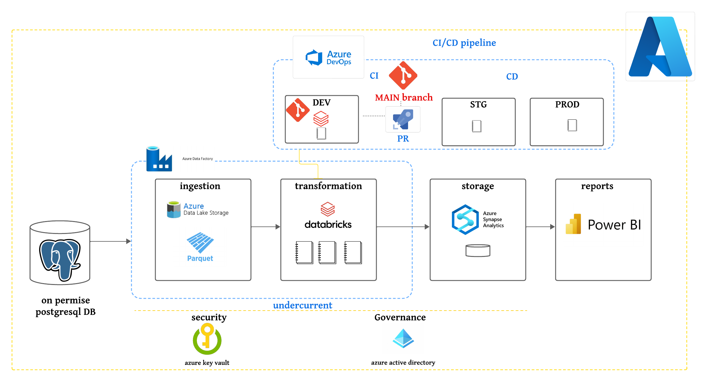

# Azure Data Engineering and CI/CD Pipeline Project

Welcome to the Azure-powered Data Engineering project with an integrated CI/CD Pipeline.

1. [Project Overview](#project-overview)
2. [Project Architecture](#project-architecture)
    1. [Data Ingestion](#data-ingestion)
    2. [Data Transformation](#data-transformation)
    3. [Data Loading](#data-loading)
    4. [Data Reporting](#data-reporting)
    5. [CI/CD Pipeline](#cicd-pipeline)
4. [Credit](#credit)
5. [Contact](#contact)

## 🚀 Project Overview

### Description:
This project orchestrates a holistic end-to-end data engineering process on Azure. Beginning with data ingestion from an on-premise PostgreSQL database, it seamlessly flows through Azure Data Lake Gen2, Azure Data Factory, Azure Databricks, and Azure Synapse Analytics. The refined insights are visualized using Power BI and streamlined by an efficient CI/CD pipeline.

### Key Components:
- **Data Source:** AdventureWorks dataset in an on-premise PostgreSQL database.
- **Data Journey:** Ingestion, Transformation, Loading, and Reporting.
- **Azure Services:** Data Lake Gen2, Data Factory, Databricks, Synapse Analytics, Power BI.
- **Security & Governance:** Utilizes Azure Key Vault and Azure Active Directory.
- **CI/CD Pipeline:** Azure DevOps automates deployment, ensuring reliability and efficiency.

**Technological Stack:** PostgreSQL, Azure Data Lake Gen2, Azure Data Factory, Azure Databricks,spark, Azure Synapse Analytics, Azure Key Vault, Azure Active Directory, Azure DevOps, Power BI.

**Outcome:**
An intelligently designed data ecosystem, safeguarded by security protocols and streamlined by an efficient CI/CD pipeline, delivering powerful insights to stakeholders.

## 🏗️ Project Architecture

**Repo Hierarchy:**
- Root Directory
  - Azure Pipeline.pdf
    - demo(Ingestion,Transformation,Loading,Reporting)
  - CI/CD Pipeline
    - demo_ci/cd.pdf
  - Dashboard
    - Power BI Format (adventureworkes.pbit)
    - PDF Format (AdventureWorkDash.png)
  - Data Set
    - set_up.md
    - update_csvs.rb
    - install.sql
  - Project Architecture (project_arch_adv.png)
  - Readme file

### 3.1. Data Ingestion

Our journey commences by seamlessly connecting the on-premise PostgreSQL database with Azure using the Microsoft Integration Runtime. In the enchanted realm of Azure, we conjure a resource group adorned with essential services like Key Vault, Storage Account, Data Factory, Databricks, and Synapse Analytics. Witness the tables gracefully migrating from on-premise SQL Server to Azure Data Lake Storage Gen2. For a live demonstration, explore the demo file within the Azure Pipeline folder.

### 3.2. Data Transformation

Mounting Azure Blob Storage to Databricks, we retrieve raw data from the azure depths of the Data Lake. With the power of the spark  Cluster in Azure Databricks, we embark on an enchanting journey of data cleaning and refinement. The cleaned data finds its sanctuary in the Delta format, optimized for further Azure analysis.

### 3.3. Data Loading

Efficiently loaded the refined dataset into Azure Synapse Analytics, establishing a dedicated SQL database.

### 3.4. Data Reporting

With Azure Synapse as our guide, we connect Microsoft Power BI for data visualizations, using the Views of the DB.

### 3.4. CI/CD Pipeline

To keep track of changes in our Databricks notebooks, we've set up a smooth CI/CD pipeline. It acts like our guiding light, making sure everything runs smoothly and efficiently, and we are up to date. Dive into the Azure Pipeline folder to check out the demo file.

**Remark:** Please explore the demo file within the Azure Pipeline folder.

## 🌟 Credits

This magnificent Azure voyage draws inspiration from the mystical teachings of the YouTube Channel ["Mr. K Talks Tech"](https://www.youtube.com/watch?v=iQ41WqhHglk).
- [AdventureWorks GitHub Repository](https://github.com/AdventureWorks/AdventureWorks-postgres)
- [Azure Data Factory Documentation](https://docs.microsoft.com/en-us/azure/data-factory/introduction)
- [Azure Databricks Documentation](https://docs.microsoft.com/en-us/azure/azure-databricks/)

## 📧 Contact

For any inquiries or to join our Azure adventure, feel free to reach out:
- [Email](souhaylaelmeftahi@gmail.com)
- [LinkedIn](https://www.linkedin.com/in/souhayla-elmeftahi-49b5251a8/)
